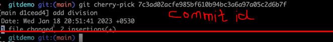
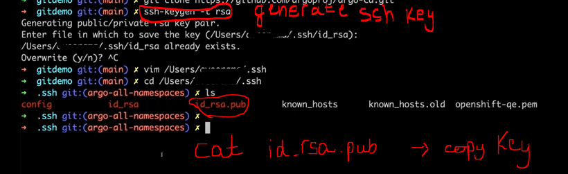

## Here's a list of some of the main Git commands and their descriptions:

    1.	sudo su
    2.	yum update -y
    3.	yum install git -y
    4.	which git
    5.	git --version
    6.	git config --global user.name "neha"
    7.	git config --global user.email "neha@gmail.com"
    8.	git config –list


```    
Command	                                                Description


git init                ===>           	Initializes a new Git repository in the current directory.

git clone <repository>  ===>	        Creates a copy of a remote repository on your local machine.

git add <file>          ===>     	    Adds changes in a file to the staging area.

git commit -m <message>	===>            Records changes to the repository with a descriptive message.

git status              ===>         	Shows the status of changes as untracked, modified, or staged.

git push                ===>            Uploads local changes to the remote repository.

git pull                ===>            Downloads changes from the remote repository to your local machine.

git fetch               ===>          	Downloads objects and refs from another repository.

git branch              ===>            Lists all local branches in the current repository.

git checkout <branch>   ===>	        Switches to the specified branch and updates the working directory.

git merge <branch>      ===>            Combines changes from the specified branch into the current branch.

git cherry-pick <log-id>===>            Merges the given change/commit(Log ID needed) from any branch to the main branch (for 1-2 commits only)

git log	                ===>            Shows a log of all commits in the current branch.

git diff                ===>       	    Shows changes between commits, commit and working tree, etc.

git stash               ===>	        Temporarily saves changes that are not ready to be committed.

git reset <file>        ===>	        Unstages the file, but preserves its contents.

git revert <commit>	    ===>            Creates a new commit that undoes changes made in the specified commit.

git remote              ===> 	        Shows all remote repositories configured in the current repository.

git config              ===> 	        Sets configuration options for Git.

git --help               ===>           To see a comprehensive list of commands and their usage.

```



## Git Cheat Sheet


To push your repo to GITHUB, you need to authenticate (create remote link) with your github.

You could generate your ssh key and then go to settings on github ===> SSH and GPG keys ===> New SSH key ===> Save your public key and you are linked to your remote repo. 



For HTTPS link, you need to enter your github password.
