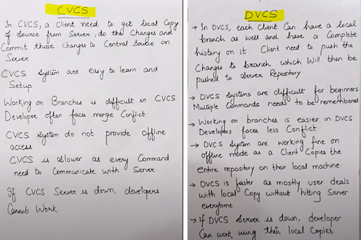
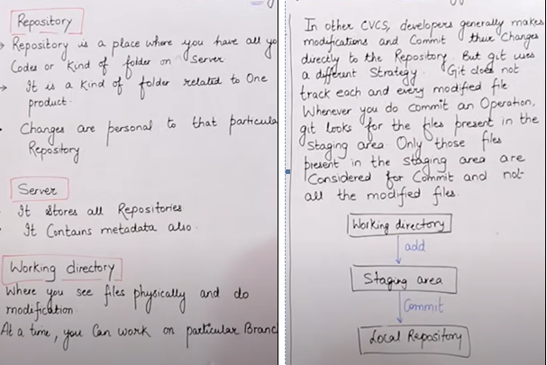
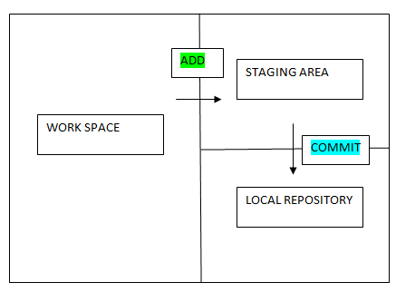
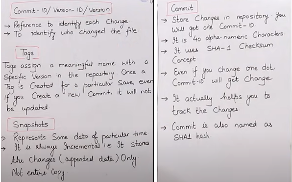
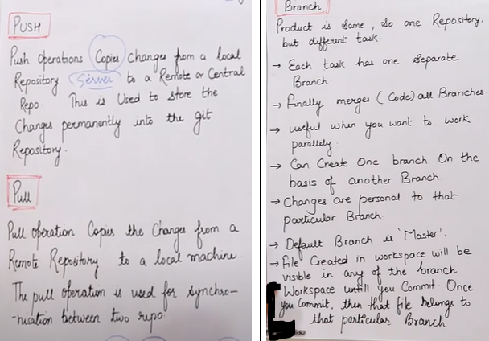

## Introduction to Git

### Centralised version control system vs. Distributed version control system

## Stages of Git and its Terminology

## Advantages of Git

   1. Distributed Version Control: Git is a distributed version control system, which means that each user has a complete copy of the entire repository. This allows for offline work and enables users to work independently without a network connection.

   2. Branching and Merging: Git makes it easy to create branches to work on new features or bug fixes without affecting the main codebase. Branches can be merged back into the main branch, allowing for easy collaboration and code integration.

   3. Data Integrity: Git uses cryptographic hashing to ensure the integrity of the data. Every change in the repository is checksummed, and the checksum is used as part of the address for that change. This means, nothing goes undetected.

   4. Speed and Performance: Git is designed to be fast and efficient, allowing for quick branching, merging, and version history operations. This speed is crucial, especially in large projects with extensive histories.

   5. Security: Git provides multiple layers of security. Repositories can be hosted on secure servers, and access can be controlled using SSH keys or other authentication methods. 

   6. Flexible Workflow: Git can adapt to various types of workflows. Whether you're working solo, as part of a small team, or in a large enterprise, 

   7. Collaboration: Git enables seamless collaboration among developers. Multiple people can work on the same project simultaneously without conflicts, thanks to Git's powerful merging capabilities. It encourages collaboration and allows developers to work on different parts of a project concurrently.

   8. Open Source: Git is open-source software, which means it is free to use, and its source code can be viewed, modified, and distributed by anyone. 

   9. Support for Non-Linear Development: Git allows developers to work in non-linear ways. They can create branches for specific features or bug fixes, work on them independently, and then merge them back into the main codebase. This approach supports agile development methodologies and enables teams to respond quickly to changing requirements.

   10. Extensibility: Git is highly extensible. Developers can extend Git's functionality by using hooks, custom scripts, and third-party tools. This extensibility allows teams to integrate Git with other tools and services, enhancing their development workflows.

## Types of Repositories

   ### Bare Repositories (Central Repo) - 
   1. Store and share only
   2. All Central repos are Bare Repos

   ### Non-Bare Repositories (Local Repo) - 
   1. You can modify the files here
   2. All Local repos are Non-Bare Repos

### git fetch only syncs changes from remote to local....
### git pull will bring actual data from remote to local
 

## git clone - to download a repository

   When you clone a repository, you create a complete copy of the entire project, including all of its branches, commit history, and files. This allows you to work on the project locally, make changes, and contribute to the repository.

## git fork - to create a copy of repository

   It allows you to create your own personal copy of someone else's repository.
   You don't use git fork from the command line; instead, you use the fork button on a platform like GitHub.
   When you fork a repository, you create a copy of the repository on your own GitHub account. You can then clone this forked repository to your local machine using git clone.

 

